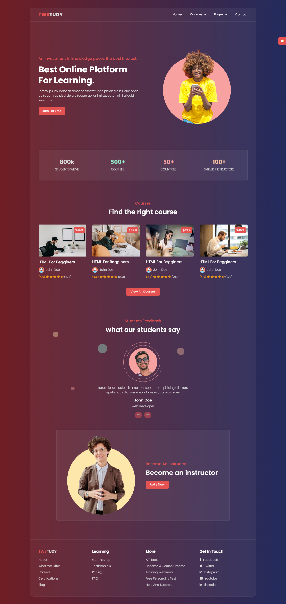
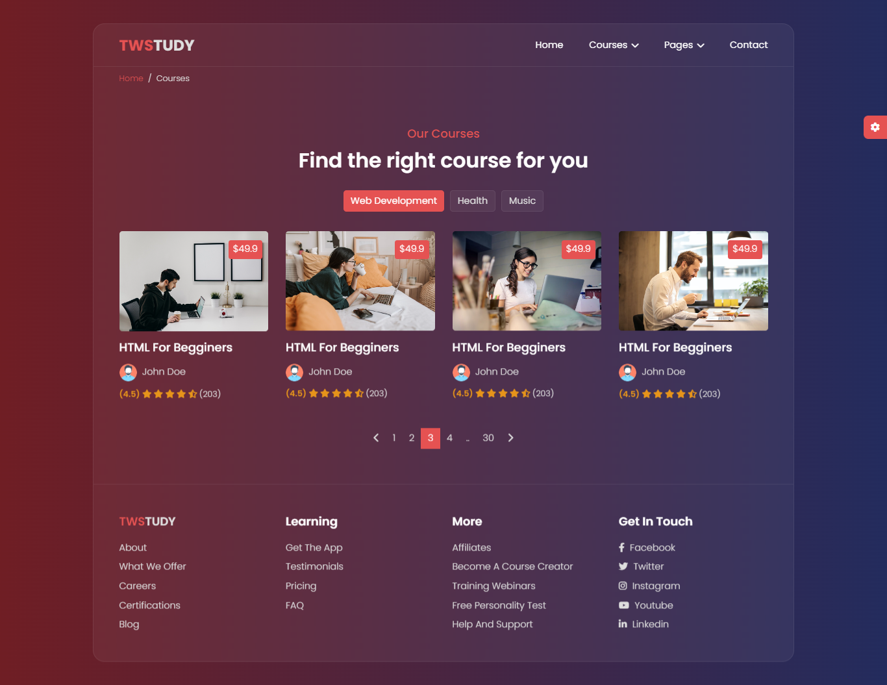
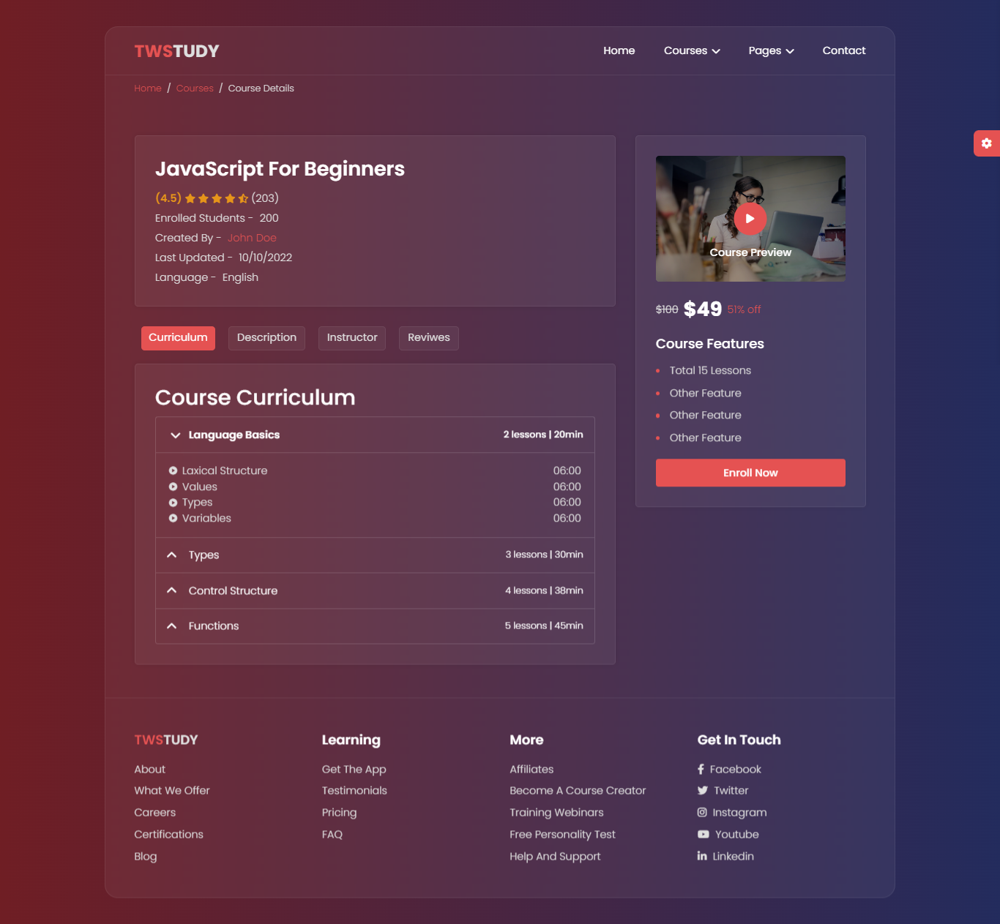
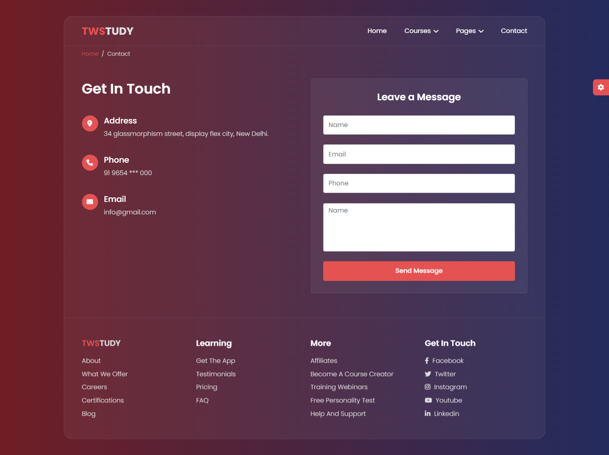

# E-Learning-Website

E-Learning-Website developed using HTML5, CSS3, Bootstrap5 and JavaScript. 

### Features:
- Six pages.
- Live style switcher.
- Light and dark modes.
- Glass morphism.
- 100% responsive.

### Demo:

 

## ScreenShots

1- Home

 

2- Courses 

  

3- Courses Details

  

4- Log In

  

5- Sign Up

  

6- Contact

Press **[here](https://hadeer-khaled.github.io/E-Learning-Website/)** to try it. 🤸‍♀️

